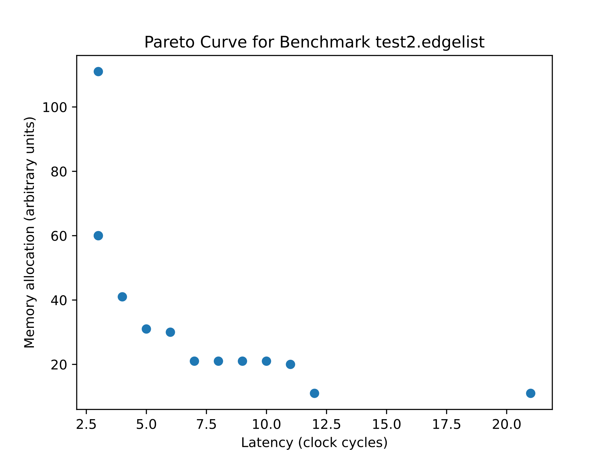

# Project Report: Memory Resource-Aware Operation Scheduling

## Tool Usage

```
$ cd src
$ python main.py -h
usage: main.py [options]

positional arguments:
  edgelist_path         Path to .edgelist file.

optional arguments:
  -h, --help            show this help message and exit
  -l <integer>, --latency <integer>
                        Latency contraint, enables latency constrained memory minimization optimization.
  -m <integer>, --memory <integer>
                        Memory contraint, enables memory constrained latency minimization.
  -mm <pessimistic|optimistic>, --memory-model <pessimistic|optimistic>
                        Memory model (pessimistic or optimistic), see README.md for more information.
  -p, --pareto-analysis
                        Do pareto curve analysis. Default is to sweep over feasible space.
  -pt <linearization|sweep>, --pareto-type <linearization|sweep>
                        Pareto front characterization method type: exhausitve sweep or linearization.
  -fp FIGURE_DIRECTORY, --figures-path FIGURE_DIRECTORY
                        Path to directory to save pareto curve figures to.

```

## The Scheduling Problem

In HLS, the problem is to take a dataflow graph (for example, extracted from a basic block in LLVM IR) and schedule each operation into time slots. The only hard requirement is that operations are scheduled such that dependent operations occur before successor operations as dictated by the edges/data dependencies in the dataflow graph. This is similar to but distinct from  a topological sort in graph theory; topological sorts are a linear sort of vertices, suitable for single threaded/single resource scenarios, whereas scheduling in general can handle arbitrary numbers of processing elements. HLS scheduling only determines when an operation occurs, and not what particular processing resource it runs on (which is taken care of as part of operation binding).

Scheduling can be more formally described as follows: given a directed acyclic graph $G(V,E)$, find nonnegative time slot assignment  $t_o\in \Z^+$ for each operation in the DFG $o\in V$ such that each data dependency $(o,p)\in E$ are scheduled in order $t_o < t_p$ [^fn1]. 

### Modeling and Solving Scheduling with Integer Linear Programming (ILP)

[Linear programming](https://en.wikipedia.org/wiki/Linear_programming) (LP) has a long history, being the simplest form of optimization program. The objective function and all constraints are linear functions of continuous variables. Integer linear programming (ILP) further constraints some (or all) of the variables to only take on integer values. Notably, instances of LP are solvable in polynomial time, while ILPs generally are not. 

The scheduling problem can be represented using ILP. We can represent the feasible set of schedules (i.e. all schedules that respect data edges in the dataflow graph) using linear constraints. Using the notation from before, if $t_x$ is an integer representing the clock cycle that operation $x$ executes at, then for each data edge $(o,p)\in E$  (where $p$ consumes the output of $o$), we can use the following inequality to enforce that operations are scheduled with respect to the partial ordering in the dataflow graph:

$$
t_o < t_p \quad \forall (o,p) \in E \label{eq:scheduling}
$$

The usual optimization objective is to minimize the length of the schedule $L$, which can be found using the following constraint and objective function:

$$
t_o \leq L \quad \forall o\in V \label{eq:latency}
$$

$$
\underset{t}{\text{min }} L \label{eq:minlatency}
$$

This simple optimization problem can actually be solved in polynomial time (despite ILP being NP-hard in general) since all constraints are integer difference inequalities, and thus the solution to the LP relaxation of the problem (done by allowing the variables to take on continuous values), will still have integer solutions and thus be a valid solution to the original ILP. 

ILPs can be solved using dedicated solvers such as GLPK and Gurobi. We will use GLPK. 

### Memory Usage 
Scheduling operations can conside more than just overall schedule length/latency. This particular project is to optimize for an additional variable, memory usage. For a datapath architecture, memories/registers are needed whenever results need to be saved between clock cycles. This can determined by the operation type and the data it emits, as well as what specific data downstream operations consume. 

In general, the outputs of an operation need to be stored somewhere in the datapath so that they can exist across clock cycles. The number of active live values (to use compiler terminology) at any clock boundary determines the amount of memory needed at that clock cycle. The actual usage will depend on how specific output values are shared and used by downstream operations. I've outlined two cases: a pessimistic case, where output values aren't shared at all between downstream operations, and an optimistic case, where output data can be shared in any way among downstream operations. 

In the pessimistic case, each operation emits a unique set of outputs that are then provided to each successor operation. For example, an ADD operation outputs a 32 bit value, of which the MSBs [31:16] are passed to successor operation V1 and the LSBs [15:0] are passed to operation V2, thus requiring 32 bits of memory. In the optimistic case, successor operations share the same pool of outputs. For example, an ADD operation outputs the same 16 bit value to two downstream operations. Since the same value is given to both downstream operations, only 16 bits of memory is needed. For this project, we represent the amount of data each data edge transfers by assigning a weight $w(o,p)$ for each edge $(o,p)\in E$ in the dataflow graph. A visual representation of the difference is shown below:

 

Red lines represent clock boundaries. In the pessimistic model, each downstream operation consumes its own slice of the output of operation A, so memory usage at the first clock boundary is 8, while in the optimistic model, each downstream operation shares the same 5 outputs, so the memory usage at the first clock boundary is less, at only 5. 

Both memory models are modeled using the ILP in the next section. 

## Scheduling Optimization Problem with Memory


With memory, we can model two different optimization problems. One is to minimize schedule latency as we saw earlier (using the objective function $\ref{eq:minlatency}$) such that memory usage stays under a limit (i.e. a memory-constrained latency minimization problem). The other is the inverse: minimize *memory usage* such that the schedule length remains under a certain maximum allowable latency (i.e. a latency-constrained memory minimization problem). We can represent the total memory usage as $M$ and set the objective function to be simply

$$
\underset{t}{\text{min }} M
$$

Along with the two scheduling constraints from before (constraints $\ref{eq:scheduling}$ and $\ref{eq:latency}$), we need an additional constraint that calculates a lower bound on $M$ based on the schedule. 

### Pessimistic Memory Usage Model

For the pessimistic memory model, the memory usage for needed at a particular clock boundary for a given schedule is the number of dataflow graph data edges that cross the clock boundary (i.e. the values that need to be carried over from previous computation to future computations). Using the same notation for operation scheduling as before, the set of data edges that cross some clock $t$ can be expressed as all data edges $(o,p)\in E$ whose operation vertices satisfy $t_o<t$ (source operation is scheduled before $t$) and $\ t_p\geq t$ (destination operation is scheduled at or after $t$). Weights $w(o,p)$ for edges that satisfy this property can then be summed together to get the memory used at clock $t$. The *total* memory needed is just the amount of memory needed by the clock that has the highest memory requirements. All this can be succinctly captured in a single inequality:

$$
\sum_{(o,p)\in E} w(o,p)[(t_o < t) \land (t_p\geq t)] \leq M \quad \forall t \in [0,L_{max}-1] \label{eq:memorynonlinear}
$$

where $[(t_o < t) \land (t_p\geq t)]$ is a binary 0-1 indicator function that evaluates to 1 if all logical expressions are true, and $L_{max}$ is the maximum allowable schedule latency.  

This is very much not a linear expression, so we will need to rewrite it into an equivalent linear form[^ftn2]. First off, we want to create variables that indicate when the two inequalities in $[(t_o < t) \land (t_p\geq t)]$ are true. We can define $x_{o,t}$ as a 0-1 integer variable that takes on 1 when the left inequality  $t_o< t$ is true using the following inequality:

$$
t-t_o < L_{max} x_{o,t} \quad \forall o\in V, \forall t\in [0, L_{max}-1] \label{eq:lhs}
$$

When the LHS is positive, then the current clock $t$ is after the clock $t_o$ that operation o is scheduled for, and thus the only value of $x_{o,t}$ that makes the inequality true is 1 since the difference between $t$ and $t_o$ can never exceed $L_{max}$.

We can define a similar constraint for the other inequality $t_p \geq t$. We define a new variable $y_{o,t} $ and constrain it such that it must be true when this inequality is true with the following:

$$
t_p - t \leq L_{max}y_{o,t} \quad \forall o\in V, \forall t\in [0, L_{max}-1] \label{eq:rhs}
$$

Similarly, when the left hand side is positive, then in order for the inequality to hold, $y_{o,t}$ must be 1. 

Now that the two inequalities $t_o < t$, $t_p \geq t$ have been encoded into $x_{o,t}$ and $y_{o,t}$ respectively, we can express the full indicator function $[(t_o < t) \land (t_p\geq t)]$ as $x_{o,t}\land y_{o,t}$ Alas, this is still not linear. But, since $x$ and $y$ are constrained to be binary integer variables, we can rewrite this as a set of linear inequalities. First, we define a new binary variable$z_{o,p,t}$ and use the following constraints to enforce $x_{o,t}\land y_{o,t} = z_{o,p,t}$:

$$
x_{o,t} + y_{o,t} - 1 \leq z_{o,p,t}\\
z_{o,p,t} \leq x_{o,t}\\
z_{o,p,t} \leq y_{o,t}\\
\forall (o,p) \in E, \forall t\in [0, L_{max}-1] \label{eq:indicator}
$$

We can then rewrite ($\ref{eq:memorynonlinear}$) as 

$$
\sum_{(o,p)\in E} w(o,p)z_{o,p,t} \leq M \quad \forall t \in [0,L_{max}-1] \label{eq:memorylinear}
$$

The optimization problem is thus to minimize either $L$ or $M$ as the objective function, subject to $(\ref{eq:scheduling}, \ref{eq:latency}, \ref{eq:lhs}, \ref{eq:rhs}, \ref{eq:indicator}, \ref{eq:memorylinear})$. 

### Optimistic Memory Usage Model

Instead of considering the total weight of data edges that cross clock boundaries, no matter the source, the optimistic case only considers the maximum edge weight for all direct descendants of the same operation. This can be expressed as the following constraint:

$$
\sum_{o\in V} \text{max}\{w(o,p) | p\in\text{succ}_G(o), t_p\geq t, t_o <t\} \leq M \quad \forall t \in [0,L_{max}-1] \label{eq:optimisticmemorynonlinear}
$$

Where $\text{succ}_G(o)$ is the set of successors of operation $o$ in the dataflow graph $G$.  Again, not linear. So we'll need to do some massaging to convert it into a linear form. We can reuse the definitions from the pessimistic form to encode the expression inside the sum into a new nonnegative integer variable $m_{o,t}$. We want $m_{o,t}$ to be the maximum memory used by any downstream operation from $o$ that's scheduled after $t$, i.e. $m_{o,t} = \text{max}\{w(o,p)|p\in \text{succ}(o), t_o < t, t_p \geq t\}$. We can conveniently express this in constraint form using the $z$ values from constraint $(\ref{eq:indicator})$ as a lower bound:

$$
w(o,p)z_{o,p,t} \leq m_{o,t} \quad \forall (o,p) \in E, \forall t\in [0, L_{max}-1] \label{eq:succmemory}
$$

With $m_{o,t}$ constrained, we can substitute it into ($\ref{eq:optimisticmemorynonlinear}$) to yield the constraint

$$
\sum_{o\in V} m_{o,t} \leq M \quad \forall t \in [0, L_{max}-1] \label{eq:linearoptimisticmemory}
$$


The two objective functions are the same as the pessimistic case (memory and latency), subject to $(\ref{eq:scheduling}, \ref{eq:latency}, \ref{eq:lhs}, \ref{eq:rhs}, \ref{eq:indicator}, \ref{eq:succmemory}, \ref{eq:linearoptimisticmemory})$

# Linear Scalarization

The optimization problems from before only optimize for either memory or latency. Schedules that result should follow a pareto curve, so naturally the next problem is to find schedules that lie on the pareto curve (and are thus all, in a sense, equally optimal). 

One way of doing this is to simply sweep across various limits on $L_{max}$ and $M$ when optimizing $M$ and $L$ respectively. Another approach is to optimize for both $M$ and $L$ simultaneously using a convex combination of the two: 

$$
\underset{t}{\text{min }}\alpha M + \beta L\\ \alpha + \beta = 1,\; \alpha, \beta > 0 \nonumber
$$

Here, we can instead sweep across different values of $\alpha$ instead of manually sweeping across the feasible space. One thing to note is that the feasible space may not be convex, so this approach may not be able to find all points along the pareto curve. Additionally, this approach is best used if the pareto frontier is sufficently large such that a good manual sweep requires too much computation time. 

## Results

### Sweeping Across the Pareto Curve

The first step was to manually sweep across the Pareto curve and get a rough idea of what it looks like before moving on to using linearization to sweep. This was done by first finding the extrema points on the pareto curve, i.e. the design points that yield the absolute lowest latency and memory usage, along with the corresponding lowest achievable memory and latency respectively. Finding the absolute best latency is straightforward: just calculate the ASAP schedule length. Finding the absolute best memory usage can be done by setting the upper bound on latency ($L_{max}$) to be the number of operations in the dataflow graph (the absolute worst case, effectively removing latency constraints), and optimizing for memory usage. Once we have values for the lowest achievable latency and memory $L_{min}$ and $M_{min}$, we can then use those optimal values as constraints to find the corresponding lowest memory and latency usage which I'll denote as $M_{sup}$ and $L_{sup}$ respectively, yielding two design points: $(L_{min}, M_{sup})$ and $(L_{sup}, M_{min})$. A check is done to see if these two extreme design points are equivalent, which means that the pareto front contains exactly one point, and is the best possible solution and the feasible space is convex. 

When doing a manual sweep of the pareto curve on the given benchmarks, interestingly enough most given designs actually have     a single-point pareto front! In fact, the largest pareto frontier found contains only three points. This isn't too surprising: without any constraints on the number of active operations per clock cycle, intuition says that the best way to minimize memory usage is to minimize the lifetime of operation outputs, which is equivalent to scheduling dependent operations as soon as possible. That doesn't mean the ASAP schedule will always yield the best memory usage though! In the degenerate case where a dataflow graph  is composed of disjoint weakly connected subgraphs, optimizing for memory would schedule each subgraph to execute sequentially, while optimizing for latency would execute each subgraph concurrently. Additionally, cases where some data edges are much more data intensive than others will also yield cases that break this intuition, such as the one given in /tests. Running the pareto sweep over these test graphs yields more complex pareto curves:



[^fn1]: In some scheduling problems it's possible to have multiple dependent operations occur in the same clock. This is especially true for pipelined datapaths, where the goal is to minimize the difference in delay of each stage of a pipeline. 
[^ftn2]: Some solvers support directly solving logical constraints. 
